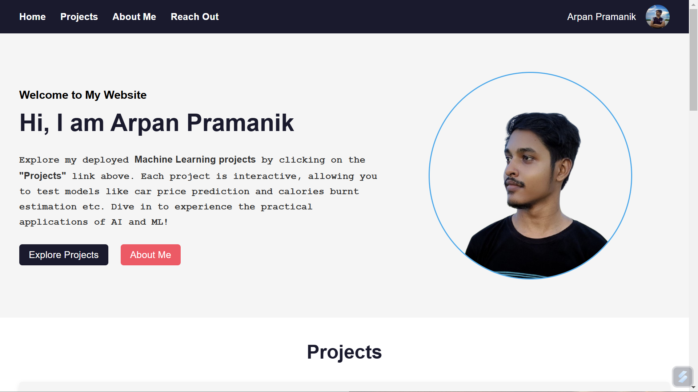

# Portfolio Website Project

This is a personal portfolio website built using **HTML** and **CSS** to showcase my profile, skills, and machine learning projects. The website is designed to be simple, responsive, and visually appealing.

---

## 🚀 Features

1. **Responsive Design**: The website adjusts to various screen sizes for a great user experience on mobile, tablet, and desktop devices.
2. **Smooth Navigation**: Navigate to different sections of the website using the header navigation bar.
3. **Project Highlights**: A dedicated section to showcase my machine learning projects with links to GitHub repositories.
4. **About Section**: Share information about myself, my education, and my skills.
5. **Reach Out Section**: Social media links to connect with me (LinkedIn, GitHub, etc.).
6. **Static Resources**: Easy-to-edit CSS and image files for customization.

---
